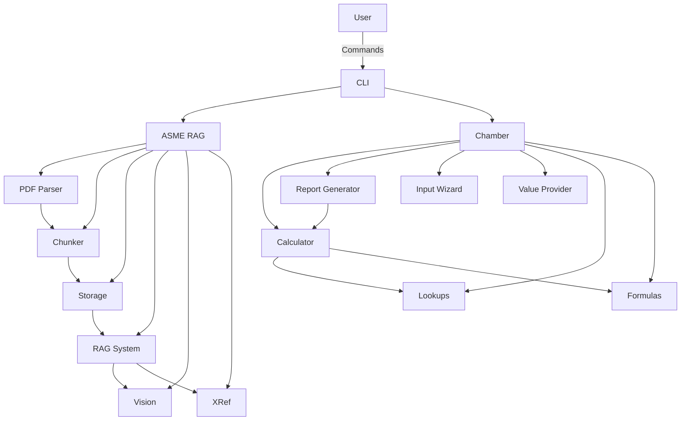
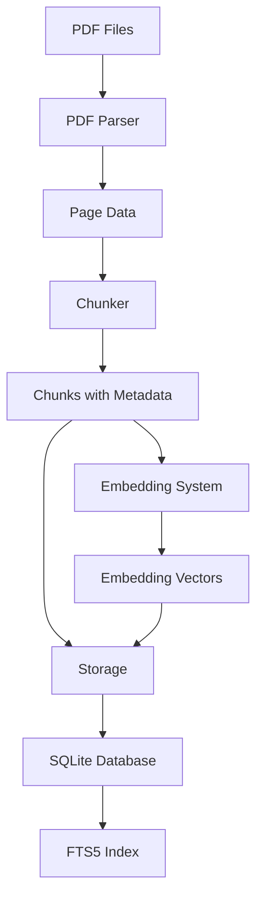
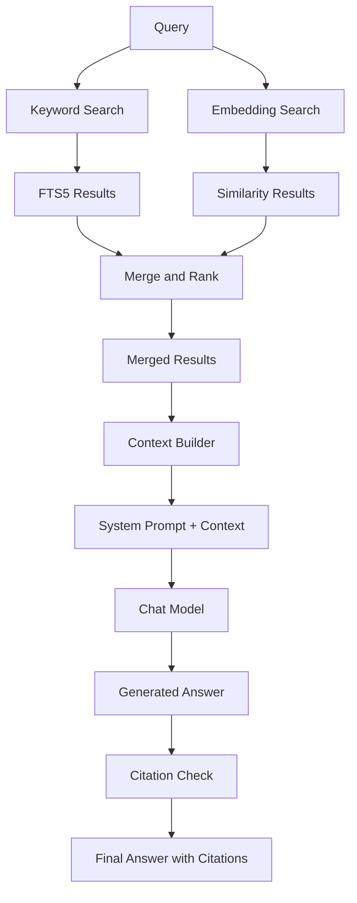
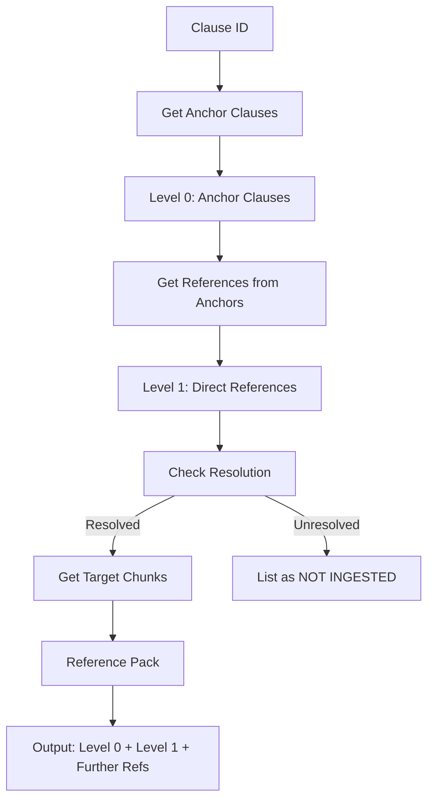
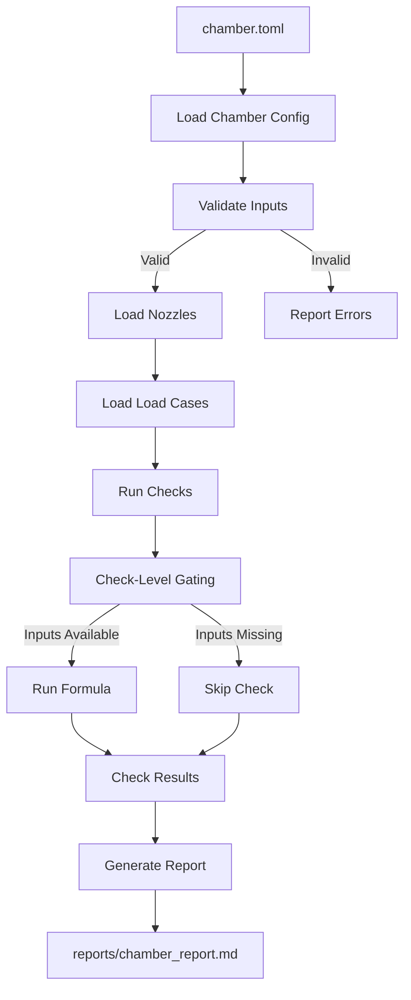

# ASME RAG + Chamber Design Assistant - Architecture

## Overview

This document describes the architecture of the ASME BPVC RAG and Chamber Design Assistant system.



## Modules and Data Flow

### Core Modules

#### 1. `asme_rag` Package

##### `pdf_parser.py`
- **Purpose**: Parse ASME PDFs into structured text blocks
- **Inputs**: PDF file paths
- **Outputs**: Structured page data with blocks, figures, metadata
- **Key Classes**:
  - `PDFParser`: Main parser class
  - `TextBlock`: A block of text with formatting
  - `FigureBlock`: A figure or image block
  - `PageData`: Data from a single page

**Data Flow**:
```
PDF File --> PyMuPDF --> blocks_from_dict() --> TextBlock objects --> PageData
```

**Features**:
- Column-aware reading order
- Header/footer/watermark detection and removal
- Figure and table detection
- Bold and superscript flag preservation
- Memory-efficient processing

##### `chunker.py`
- **Purpose**: Split parsed text into meaningful chunks with metadata
- **Inputs**: Parsed page data, document metadata
- **Outputs**: List of chunks with metadata
- **Key Classes**:
  - `Chunker`: Main chunker class
  - `Chunk`: A chunk with text and metadata

**Data Flow**:
```
PageData --> Chunker --> ChunkMetadata objects
```

**Features**:
- Profile-specific chunking (code_book, materials_data, material_specs, standard)
- Clause boundary detection
- Long clause splitting at sub-paragraph boundaries
- Metadata preservation (doc_id, code, division, edition, clause_id, page, type, etc.)

##### `storage.py`
- **Purpose**: SQLite storage with FTS5 for efficient retrieval
- **Inputs**: Chunks, embeddings, cross-references
- **Outputs**: Stored data, search results
- **Key Classes**:
  - `Storage`: Main storage class
  - `StorageStats`: Database statistics

**Data Flow**:
```
Chunks --> Storage.store_chunks() --> SQLite database
Embeddings --> Storage.store_embeddings() --> SQLite database
Queries --> Storage.search_chunks() --> Results
```

**Database Tables**:
- `documents`: Document registry
- `chunks`: Text chunks with metadata
- `embeddings`: Embedding vectors
- `chunks_fts`: FTS5 full-text search table
- `cross_references`: Cross-reference links
- `figures`: Figure descriptions

##### `rag.py`
- **Purpose**: Retrieval-Augmented Generation system
- **Inputs**: Queries, filters
- **Outputs**: Retrieved excerpts, generated answers
- **Key Classes**:
  - `RAGSystem`: Main RAG class
  - `GroundedAnswer`: Answer with citations

**Data Flow**:
```
Query --> search() --> [Keyword Search + Embedding Search] --> Merged Results
Merged Results + Question --> answer_question() --> Grounded Answer
```

**Features**:
- Hybrid retrieval (SQLite FTS5 + embedding similarity)
- Grounded answer generation with system prompt
- Citation checking
- Materials lookup
- Model evaluation

**System Prompt**:
- Answer ONLY from provided excerpts
- Cite every statement as [code, edition, clause, PDF p.N]
- Never invent equations, constants, table values, or clause numbers
- Flag garbled tables or equations
- Do not perform final design calculations
- List missing information under NEEDS INPUT

##### `vision.py`
- **Purpose**: Vision-based analysis of figures, charts, and tables
- **Inputs**: Image data, prompts
- **Outputs**: Descriptions, readings, transcriptions
- **Key Classes**:
  - `VisionSystem`: Main vision class
  - `FigureDescription`: Description of a figure
  - `VisionReading`: A reading from vision analysis
  - `VisionTestResult`: Result of a vision test

**Data Flow**:
```
Figure Region --> render_figure_region() --> Image Data
Image Data + Prompt --> analyze_with_vision() --> Vision Model --> Result
```

**Features**:
- Figure detection and description
- Chart value reading (with repeat reads for stability)
- Table transcription
- Vision testing

**All outputs are marked as UNVERIFIED until confirmed by the user.**

##### `xref.py`
- **Purpose**: Cross-reference expansion
- **Inputs**: Clause IDs, documents
- **Outputs**: Expanded reference packs
- **Key Classes**:
  - `CrossReferenceExpander`: Main expander class
  - `Reference`: A cross-reference link
  - `ReferenceItem`: An item in the reference pack

**Data Flow**:
```
Clause ID --> expand() --> [Level 0 + Level 1] --> Reference Pack
```

**Features**:
- Reference detection from text
- Depth-limited expansion (MAX DEPTH = 1)
- Reference pack generation
- Rule map generation
- Footnote and table note linking

**Depth Rule**:
- Level 0: Anchor clauses found by retrieval
- Level 1: Everything the anchors directly refer to
- Level 1 items are NOT expanded further
- Further references are listed but not expanded

##### `cli.py`
- **Purpose**: Command-line interface
- **Inputs**: Command arguments
- **Outputs**: Command execution, file outputs

**Commands**:
- `check`: Verify system configuration
- `ingest`: Parse and chunk PDFs
- `embed`: Create embeddings
- `search`: Perform retrieval search
- `ask`: Ask a question
- `chat`: Interactive chat
- `refs`: Expand cross-references
- `rulemap`: Generate rule map
- `materials`: List materials for a grade
- `describe-figures`: Describe figures
- `figure-read`: Read values from figures
- `table-from-image`: Transcribe tables
- `vision-test`: Test vision
- `eval`: Evaluate models
- `page`: Show page reading order
- `clause`: Print clause with metadata
- `inspect`: List structure and chunk counts

#### 2. `chamber` Package

##### `calc.py`
- **Purpose**: Main calculation engine
- **Inputs**: chamber.toml, nozzles.toml
- **Outputs**: Check results, report data
- **Key Classes**:
  - `ChamberCalculator`: Main calculator class
  - `CheckResult`: Result from a design check
  - `LoadCase`: A load case
  - `Nozzle`: A nozzle configuration

**Data Flow**:
```
chamber.toml + nozzles.toml --> load_*() --> Input Data
Input Data --> validate_inputs() --> Validation Results
Input Data --> run_checks() --> Check Results
```

**Features**:
- TOML loading and validation
- Check-level gating (ASK/LOOKUP skip only dependent checks)
- Formula plugin execution
- Pressure convention handling (GAUGE, negative for vacuum)
- FEA recommendation flag

**Check-Level Gating**:
- Each check declares required inputs
- Input is "not provided" if ASK, LOOKUP unresolved, or absent
- Checks with missing inputs are SKIPPED
- All other checks still run
- Skipped checks listed under NOT CHECKED

**Pressure Convention**:
- GAUGE pressure (atmosphere = 0)
- Vacuum is negative (e.g., -0.101 MPa for full vacuum)
- Net load on wall = pressure difference across it
- For inner wall: jacket pressure - chamber pressure (external pressure)
- For jacket outer wall: jacket pressure (internal pressure)

##### `report.py`
- **Purpose**: Generate design reports
- **Inputs**: chamber.toml, nozzles.toml, check results
- **Outputs**: Markdown report
- **Key Classes**:
  - `ReportGenerator`: Main report class

**Report Structure**:
1. Document control (title, project, date, author, reviewer, approval)
2. Scope and governing code (code, edition, confirmed rule path, design basis)
3. Input summary (all TOML values with units and file hashes)
4. Load cases and pressure convention
5. Results per component (required vs provided, margin, utilisation, pass/fail)
6. Nozzle reinforcement (area-balance table)
7. Jacket ribs and panel checks
8. Verified-data register
9. NOT CHECKED list, FEA-recommended flag, assumptions, open items
10. Testing requirements (citations only)
11. References (books, editions, standards ingested)

**Output**:
- Plain Markdown for easy conversion to Word/PDF
- Field origins tagged: [code: clause], [user], [MISSING]
- PDF page links (configurable)

##### `init.py`
- **Purpose**: Interactive input wizard
- **Inputs**: User responses
- **Outputs**: chamber.toml, nozzles.toml
- **Key Classes**:
  - `InputWizard`: Main wizard class

**Features**:
- Guided input one value at a time
- Explanations for each field
- Allowed choices for dropdown-like selection
- Skip option for each field
- Help option for more information

##### `provide.py`
- **Purpose**: Store confirmed values
- **Inputs**: key, value, source, date
- **Outputs**: CSV files with verified data
- **Key Classes**:
  - `ValueProvider`: Main provider class

**Data Storage**:
- `data/verified/allowables.csv`: Allowable stress values
- `data/verified/ext_pressure_charts.csv`: External pressure chart readings
- `data/verified/fea_results.csv`: FEA results
- `data/verified/other_verified.csv`: Other verified values

**Value Confirmation**:
- All values stored with source, page, date
- Values proposed by vision are UNVERIFIED until user confirms
- Only confirmed values are used in calculations

##### `formulas.py`
- **Purpose**: Formula plugins for code rules
- **Inputs**: Input values, code, edition
- **Outputs**: Calculation results
- **Key Classes**:
  - `FormulaPlugin`: Base class for formulas
  - `FormulaResult`: Result from a formula
  - `FormulaManager`: Manager for formula plugins

**Implemented Formulas**:
- `WallThicknessFormula`: UG-22 (VERIFY_AGAINST_PDF)
- `ExternalPressureFormula`: UG-37 (VERIFY_AGAINST_PDF)
- `OpeningReinforcementFormula`: UG-37 to UG-45 (VERIFY_AGAINST_PDF)
- `JacketFormula`: Part UJV (VERIFY_AGAINST_PDF)

**Formula Status**:
- All formulas are STUBS
- Each stub marked with VERIFY_AGAINST_PDF
- Must be filled from confirmed clause text
- Never write formulas from memory

##### `lookups.py`
- **Purpose**: Data lookup functions
- **Inputs**: Specifications, grades, dimensions
- **Outputs**: Lookup results with citations
- **Key Classes**:
  - `Lookups`: Main lookup class
  - `LookupResult`: Result from a lookup

**Implemented Lookups**:
- `allowable_lookup`: Allowable stress from Section II-D
- `pipe_lookup`: Pipe dimensions from B36.10
- `flange_lookup`: Flange ratings from B16.5
- `material_spec_lookup`: Material specifications from Section II-A

**Lookup Status**:
- All lookups return CANDIDATE values
- Values must be confirmed by user before use
- Citations provided for all results

## Configuration

### `config.toml`

Central configuration file with sections:

- `[general]`: Project settings
- `[lm_studio]`: LM Studio API settings
- `[vision]`: Vision settings
- `[pdf_parser]`: PDF parsing settings
- `[chunker]`: Chunking settings
- `[[documents]]`: Document registry
- `[storage]`: Database settings
- `[retrieval]`: Retrieval settings
- `[embedding]`: Embedding settings
- `[xref]`: Cross-reference settings
- `[links]`: PDF link settings
- `[serve]`: Web server settings (optional)
- `[output]`: Output settings
- `[chamber]`: Chamber design settings
- `[eval]`: Evaluation settings
- `[logging]`: Logging settings

### Environment Variables

None required. All configuration in `config.toml`.

## Data Flow Diagrams

### Ingestion Flow



### Retrieval Flow



### Cross-Reference Expansion Flow



### Chamber Calculation Flow



## Key Design Decisions

### 1. Offline-First
- No internet access required at runtime
- All models run locally via LM Studio
- All PDFs stored locally
- All data in SQLite database

### 2. Model-Agnostic
- Model name comes from `config.toml`
- Works with any OpenAI-compatible model
- Vision model same as chat model (if vision-capable)

### 3. No Invention of Engineering Content
- Never write ASME formulas from memory
- All formulas marked VERIFY_AGAINST_PDF
- All values from retrieved text or user confirmation
- All outputs clearly marked as verified or unverified

### 4. Check-Level Gating
- Missing inputs skip only dependent checks
- Other checks continue to run
- Clear reporting of skipped checks
- NEEDS INPUT list for user action

### 5. Conservative Defaults
- No structural credit for jacket ribs
- All formulas conservative placeholders
- FEA recommendation for complex geometries

### 6. User Verification Required
- Vision outputs always UNVERIFIED
- Lookup results always CANDIDATE
- Only user-confirmed values used in calculations
- Verified values stored with source, page, date

### 7. Depth-Limited Cross-Reference Expansion
- Maximum depth = 1 (hard limit)
- Prevents recursive chains
- Lists further references without expansion
- User can select which to expand

## File Locations

| Purpose | Location |
|---------|----------|
| ASME PDFs | `data/pdfs/` |
| SQLite Database | `data/asme_rag.db` |
| Verified Data CSVs | `data/verified/` |
| Chat Outputs | `outputs/chat/` |
| Debug Images | `outputs/debug_images/` |
| Reports | `reports/` |
| Configuration | `config.toml` |
| Logs | `logs/asme_rag.log` |

## Changing the Code

See `docs/CHANGING_THE_CODE.md` for detailed instructions on:
- Adding a new book or edition
- Changing clause-ID regexes
- Adding a new check
- Adding or renaming TOML/CSV keys
- Switching the chat model
- Changing thresholds
- Changing cross-reference limits
- Changing PDF link style
- Adding vision test cases

## Testing

See `tests/` directory for unit tests covering:
- PDF parsing (synthetic pages)
- Chunking and metadata
- Storage and retrieval
- Citation checking
- Cross-reference expansion
- Formula calculations
- Report generation
- Vision analysis (with fake server)

Run tests with:
```bash
python -m pytest tests/ -v
```

## Performance Considerations

1. **PDF Parsing**: PyMuPDF is fast but memory-intensive for large PDFs
2. **Embedding**: Batch processing for efficiency
3. **Retrieval**: FTS5 + embedding hybrid for accuracy
4. **Vision**: GPU memory limited (8GB RTX 4000)
   - Reduce `render_dpi` if needed
   - Process one image at a time
   - Limit `max_figures_per_run`

## Security Considerations

1. **No External Connections**: Only connects to local LM Studio
2. **No Telemetry**: No data collection or reporting
3. **Local Only**: Web server binds to 127.0.0.1 only
4. **File Permissions**: Database and outputs in project directory

## Future Enhancements

1. **Additional Books**: Section IX (WPS, PQR, WPQ), B31.3
2. **Advanced Retrieval**: Better chunking, better embedding models
3. **Better Vision**: Improved figure detection, chart reading accuracy
4. **Formula Verification**: Automated verification against PDF text
5. **Code Updates**: Support for new ASME editions
6. **Web Interface**: Full-featured web UI (phase 10)
